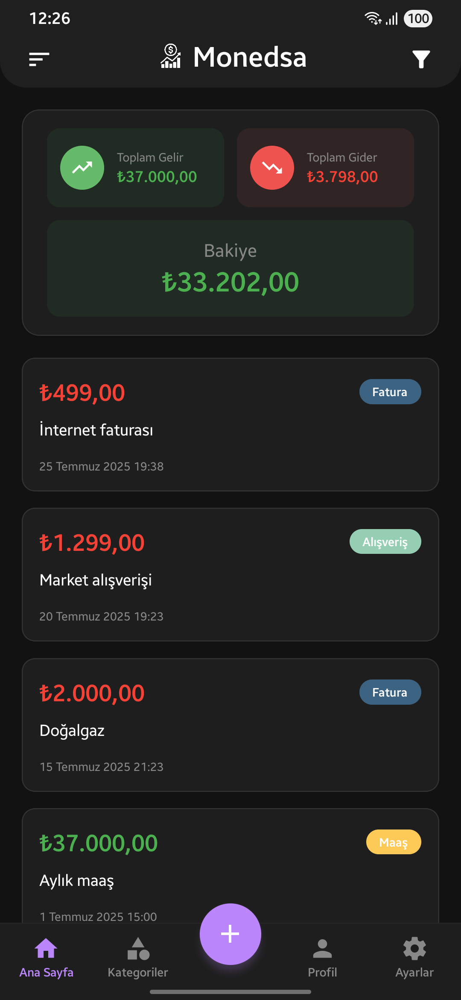
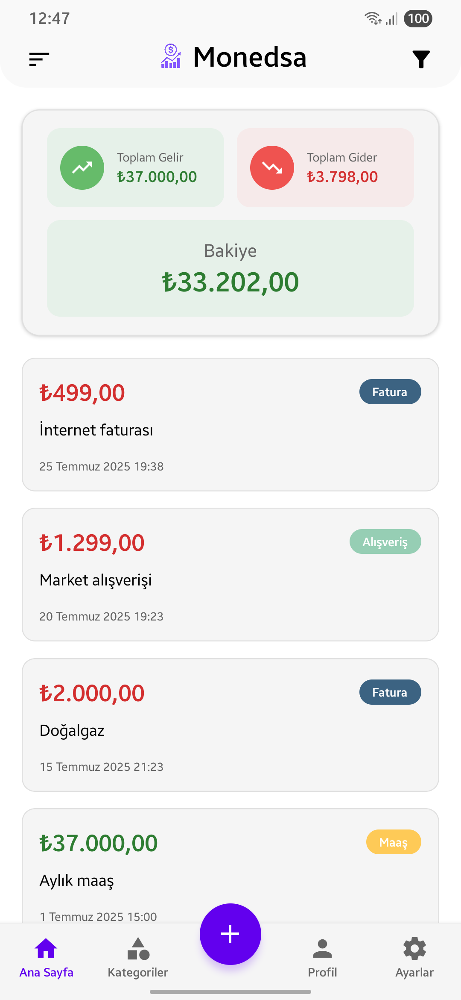
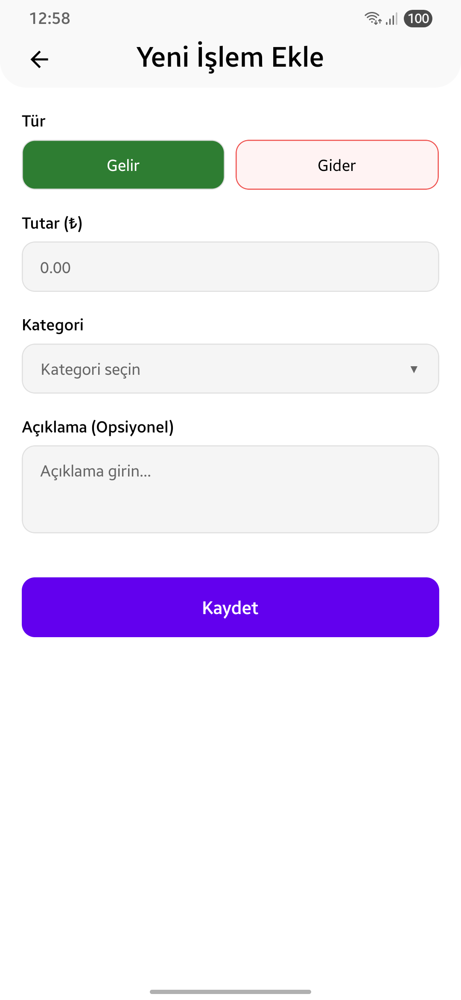
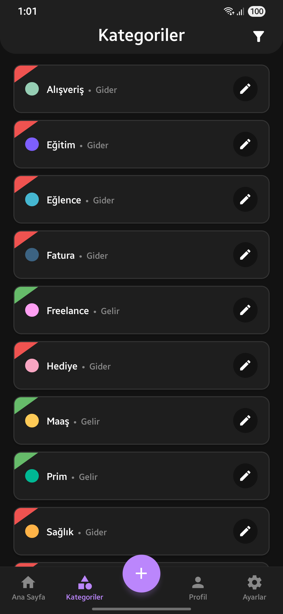
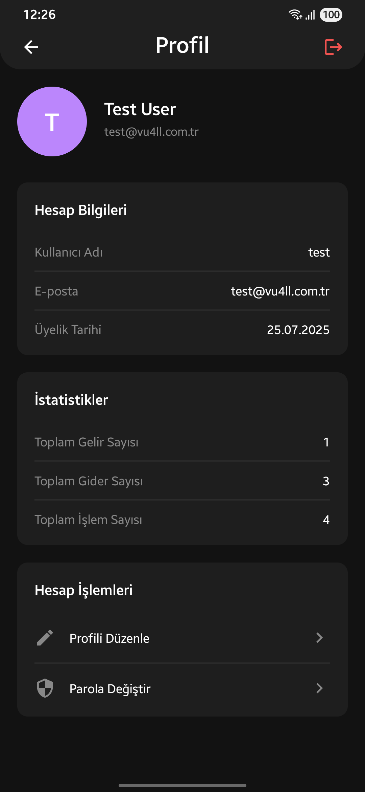

# Monedsa - Gelir Gider Takip Uygulaması


Turkish | [English](README_EN.md) | [Dutch](README_NL.md)

**Monedsa**, Android cihazlarınızda kolayca gelir ve giderlerinizi takip edebileceğiniz modern ve kullanıcı dostu bir mobil uygulamadır. Basit, hızlı ve güvenli yapısıyla finansal durumunuzu kontrol altında tutmanıza yardımcı olur.

## 📱 Özellikler

### 💰 Gelir ve Gider Yönetimi
- Gelir ve giderlerinizi kolayca ekleyin, düzenleyin ve silin
- Detaylı açıklamalar ve kategoriler ile işlemlerinizi organize edin
- Gerçek zamanlı bakiye hesaplama

### 📊 Kategori Sistemi
- Özel kategoriler oluşturun
- Renk kodlama sistemi ile kategorilerinizi ayırt edin
- Gelir ve gider için ayrı kategori yönetimi

### 📈 Finansal Analiz
- Toplam gelir, gider ve bakiye görünümü
- İşlem geçmişi ve detaylı raporlama
- Filtreleme ve sıralama özellikleri

### 🔒 Güvenlik
- Kullanıcı hesabı sistemi ile güvenli veri saklama
- JWT token tabanlı kimlik doğrulama
- Şifreli veri iletimi

### 🎨 Modern Arayüz
- Karanlık ve aydınlık tema desteği
- Responsive tasarım
- Sezgisel kullanıcı deneyimi

## 🚀 Hızlı Başlangıç

### Gereksinimler

- **Node.js** 18 veya üzeri
- **React Native CLI** kurulu olmalı
- **Android 7 (API 24)** ve üzeri cihaz
- **Android Studio** (Android geliştirme için)
- **MongoDB** veritabanı

### Kurulum

1. **Projeyi klonlayın:**
```bash
git clone https://github.com/Vu4ll/monedsa.git
cd monedsa
```

2. **Backend kurulumu:**
```bash
cd server
npm install
```

3. **Backend yapılandırması:**
```bash
# server dizininde .env dosyası oluşturun
cp .env.example .env
# Gerekli ortam değişkenlerini düzenleyin
```

4. **Frontend kurulumu:**
```bash
# Ana dizine dönün
cd ..
npm install
```

5. **Android bağımlılıklarını yükleyin:**
```bash
cd android
./gradlew clean
cd ..
```

### Çalıştırma

1. **Backend sunucusunu başlatın:**
```bash
cd server
npm start
# veya geliştirme modu için
npm run dev
```

2. **React Native Metro sunucusunu başlatın:**
```bash
# Ana dizinde
npm start
```

3. **Android uygulamasını çalıştırın:**
```bash
npm run android
```

## 🏗️ Proje Yapısı

```
monedsa/
├── 📱 src/                    # React Native kaynak kodları
│   ├── components/            # Yeniden kullanılabilir bileşenler
│   ├── screens/              # Uygulama ekranları
│   ├── services/             # API servis katmanı
│   ├── hooks/                # Özel React hooks
│   ├── contexts/             # React context'leri
│   ├── utils/                # Yardımcı fonksiyonlar
│   └── constants/            # Sabitler ve yapılandırmalar
├── 🖥️ server/                 # Node.js backend
│   ├── routes/               # API rotaları
│   ├── models/               # MongoDB modelleri
│   ├── middlewares/          # Express middlewares
│   ├── utils/                # Backend yardımcı fonksiyonları
│   ├── locales/              # Çok dil desteği
│   └── public/               # Statik dosyalar
└── 📂 android/               # Android native kodları
```

## 🔧 Teknolojiler

### Frontend (Mobile)
- **React Native** 0.80.1
- **React Navigation** - Navigasyon sistemi
- **Axios** - HTTP istemcisi
- **AsyncStorage** - Yerel veri saklama
- **Vector Icons** - İkon kütüphanesi

### Backend
- **Node.js** & **Express** - Web sunucusu
- **MongoDB** & **Mongoose** - Veritabanı
- **JWT** - Kimlik doğrulama
- **Argon2** - Şifre hashleme
- **CORS** - Cross-origin kaynak paylaşımı

## 📊 API Endpoints

### Kimlik Doğrulama
```
POST /api/auth/login          # Kullanıcı girişi
POST /api/auth/register       # Kullanıcı kaydı
POST /api/auth/refresh        # Token yenileme
```

### İşlemler
```
GET    /api/transaction/list     # İşlem listesi
POST   /api/transaction/add      # Yeni işlem ekleme
PUT    /api/transaction/edit/:id # İşlem güncelleme
DELETE /api/transaction/delete/:id # İşlem silme
GET    /api/transaction/expenses # Sadece giderler
GET    /api/transaction/incomes  # Sadece gelirler
```

### Kategoriler
```
GET    /api/category/list        # Kategori listesi
POST   /api/category/add         # Yeni kategori
PUT    /api/category/edit/:id    # Kategori güncelleme
DELETE /api/category/delete/:id  # Kategori silme
```

### Profil
```
GET  /api/profile/me             # Kullanıcı bilgileri
GET  /api/profile/stats          # İstatistikler
PUT  /api/profile/update         # Profil güncelleme
PUT  /api/profile/change-password # Şifre değiştirme
```

## 🌟 Ekran Görüntüleri

| Ana Sayfa | Ana Sayfa (Beyaz Tema) | İşlem Ekleme (Beyaz Tema) | Kategoriler | Profil |
|-----------|-----------|-----------|-----------|-----------|
|  |  |  |  |  |

- Ana Sayfa: Bakiye özeti ve son işlemler
- İşlem Ekleme: Yeni gelir/gider ekleme formu
- Kategoriler: Kategori yönetimi ve renk seçimi
- Profil: Kullanıcı bilgileri ve istatistikler

## 🤝 Katkıda Bulunma

1. Bu projeyi fork edin
2. Yeni bir feature branch oluşturun (`git checkout -b feature/new-feat`)
3. Değişikliklerinizi commit edin (`git commit -am 'Yeni özellik eklendi'`)
4. Branch'inizi push edin (`git push origin feature/new-feat`)
5. Pull Request oluşturun

## 📝 Lisans

- Bu proje GPL3 lisansı altında lisanslanmıştır. Detaylar için [LICENSE](LICENSE) dosyasını inceleyin.
- **Gizlilik politikası**: [monedsa.vu4ll.com.tr/privacy-policy](https://monedsa.vu4ll.com.tr/privacy-policy/tr)

## 📞 İletişim

- **Web sitesi:** [vu4ll.com.tr](https://vu4ll.com.tr)
- **E-posta:** [contact@vu4ll.com.tr](mailto:contact@vu4ll.com.tr)

---

**Monedsa** ile finansal durumunuzu kolayca takip edin ve bütçenizi kontrol altında tutun! 💰📊