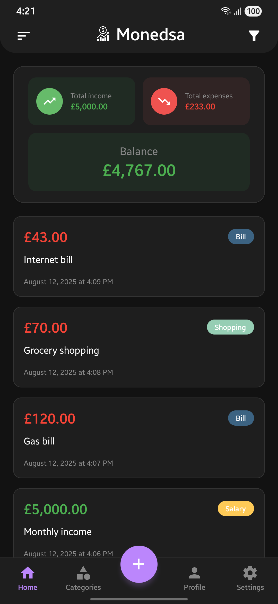
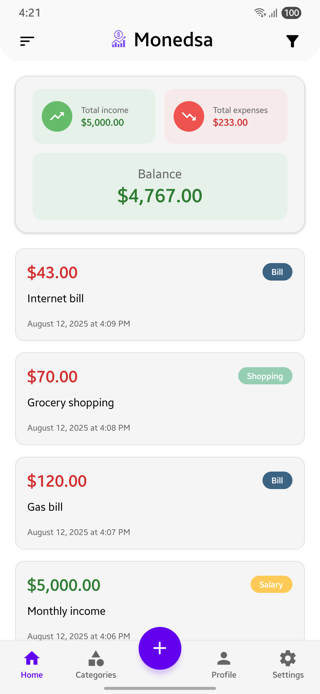
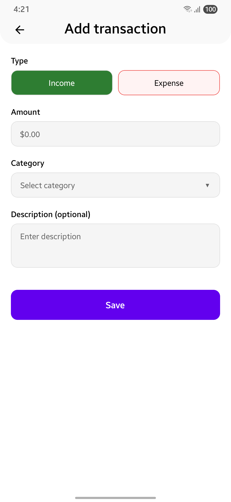
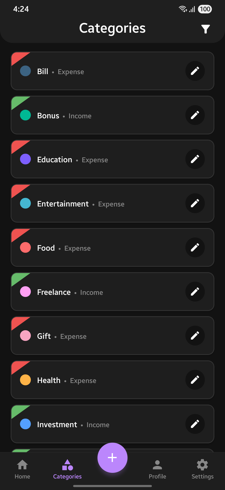
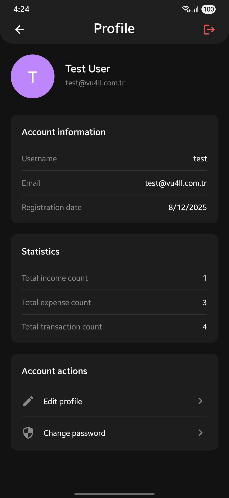

# Monedsa - Income & Expense Tracker


[Turkish](README_TR.md) | English | [Dutch](README_NL.md)


**Monedsa** is a modern and user-friendly mobile application that allows you to easily track your income and expenses on Android devices. With its simple, fast, and secure structure, it helps you keep your financial situation under control.

## 📱 Features

### 💰 Income & Expense Management
- Easily add, edit, and delete your income and expenses
- Organize your transactions with detailed descriptions and categories
- Real-time balance calculation

### 📊 Category System
- Create custom categories
- Distinguish your categories with color coding system
- Separate category management for income and expenses

### 📈 Financial Analysis
- Total income, expense, and balance overview
- Transaction history and detailed reporting
- Filtering and sorting features

### 🔒 Security
- Secure data storage with user account system
- JWT token-based authentication
- Encrypted data transmission

### 🎨 Modern Interface
- Dark and light theme support
- Responsive design
- Intuitive user experience

## 🚀 Quick Start

### Requirements

- **Node.js** 18 or higher
- **React Native CLI** installed
- **Android 7 (API 24)** or higher device
- **Android Studio** (for Android development)
- **MongoDB** database

### Installation

1. **Clone the project:**
```bash
git clone https://github.com/Vu4ll/monedsa.git
cd monedsa
```

2. **Backend setup:**
```bash
cd server
npm install
```

3. **Backend configuration:**
```bash
# Create .env file in server directory
cp .env.example .env
# Edit the required environment variables
```

4. **Frontend setup:**
```bash
# Return to main directory
cd ..
npm install
```

5. **Install Android dependencies:**
```bash
cd android
./gradlew clean
cd ..
```

### Running

1. **Start the backend server:**
```bash
cd server
npm start
# or for development mode
npm run dev
```

2. **Start React Native Metro server:**
```bash
# In main directory
npm start
```

3. **Run Android application:**
```bash
npm run android
```

## 🏗️ Project Structure

```
monedsa/
├── 📱 src/                    # React Native source code
│   ├── components/            # Reusable components
│   ├── screens/              # Application screens
│   ├── services/             # API service layer
│   ├── hooks/                # Custom React hooks
│   ├── contexts/             # React contexts
│   ├── utils/                # Utility functions
│   └── constants/            # Constants and configurations
├── 🖥️ server/                 # Node.js backend
│   ├── routes/               # API routes
│   ├── models/               # MongoDB models
│   ├── middlewares/          # Express middlewares
│   ├── utils/                # Backend utility functions
│   ├── locales/              # Multi-language support
│   └── public/               # Static files
└── 📂 android/               # Android native code
```

## 🔧 Technologies

### Frontend (Mobile)
- **React Native** 0.80.1
- **React Navigation** - Navigation system
- **Axios** - HTTP client
- **AsyncStorage** - Local data storage
- **Vector Icons** - Icon library

### Backend
- **Node.js** & **Express** - Web server
- **MongoDB** & **Mongoose** - Database
- **JWT** - Authentication
- **Argon2** - Password hashing
- **CORS** - Cross-origin resource sharing

## 📊 API Endpoints

### Authentication
```
POST /api/auth/login          # User login
POST /api/auth/register       # User registration
POST /api/auth/refresh        # Token refresh
```

### Transactions
```
GET    /api/transaction/list     # Transaction list
POST   /api/transaction/add      # Add new transaction
PUT    /api/transaction/edit/:id # Update transaction
DELETE /api/transaction/delete/:id # Delete transaction
GET    /api/transaction/expenses # Expenses only
GET    /api/transaction/incomes  # Incomes only
```

### Categories
```
GET    /api/category/list        # Category list
POST   /api/category/add         # New category
PUT    /api/category/edit/:id    # Update category
DELETE /api/category/delete/:id  # Delete category
```

### Profile
```
GET  /api/profile/me             # User information
GET  /api/profile/stats          # Statistics
PUT  /api/profile/update         # Update profile
PUT  /api/profile/change-password # Change password
```

## 🌟 Screenshots

| Home Screen | Home Screen (White Theme) | Add Transaction (White Theme) | Categories | Profile |
|-----------|-----------|-----------|-----------|-----------|
|  |  |  |  |  |

- Home Screen: Balance summary and recent transactions
- Add Transaction: New income/expense entry form
- Categories: Category management and color selection
- Profile: User information and statistics

## 🤝 Contributing

1. Fork this project
2. Create a new feature branch (`git checkout -b feature/new-feature`)
3. Commit your changes (`git commit -am 'Add new feature'`)
4. Push your branch (`git push origin feature/new-feature`)
5. Create a Pull Request

## 📝 License

- This project is licensed under the GPL3 License. See the [LICENSE](LICENSE) file for details.
- **Privacy Policy**: [monedsa.vu4ll.com.tr/privacy-policy](https://monedsa.vu4ll.com.tr/privacy-policy)

## 📞 Contact

- **Website:** [vu4ll.com.tr](https://vu4ll.com.tr)
- **E-mail:** [contact@vu4ll.com.tr](mailto:contact@vu4ll.com.tr)

---

**Monedsa** - Easily track your financial situation and keep your budget under control! 💰📊
