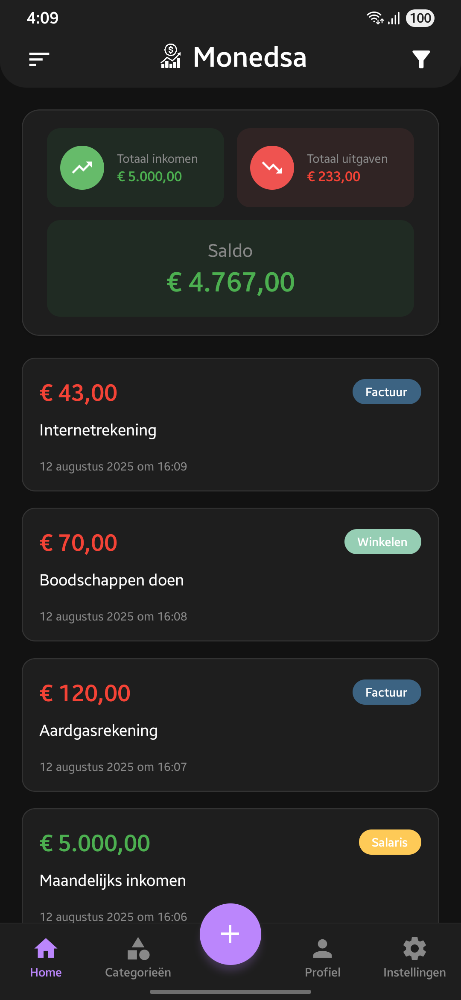
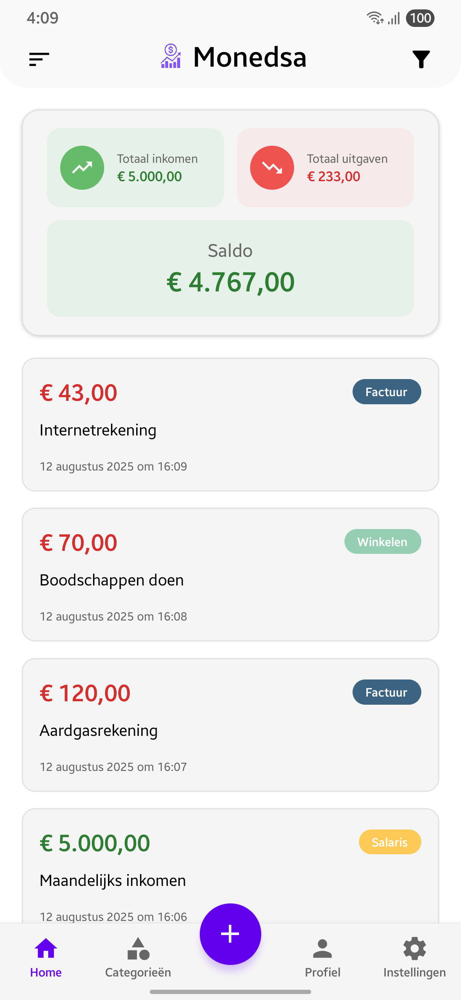
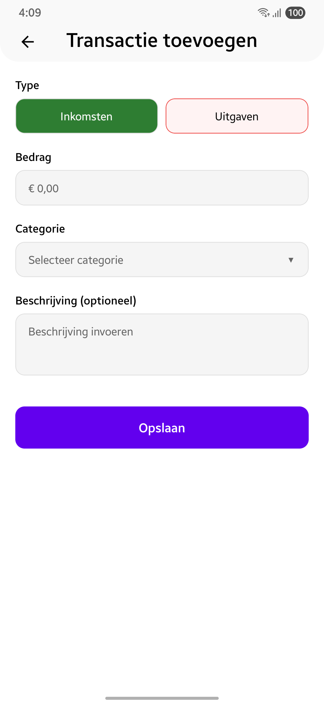
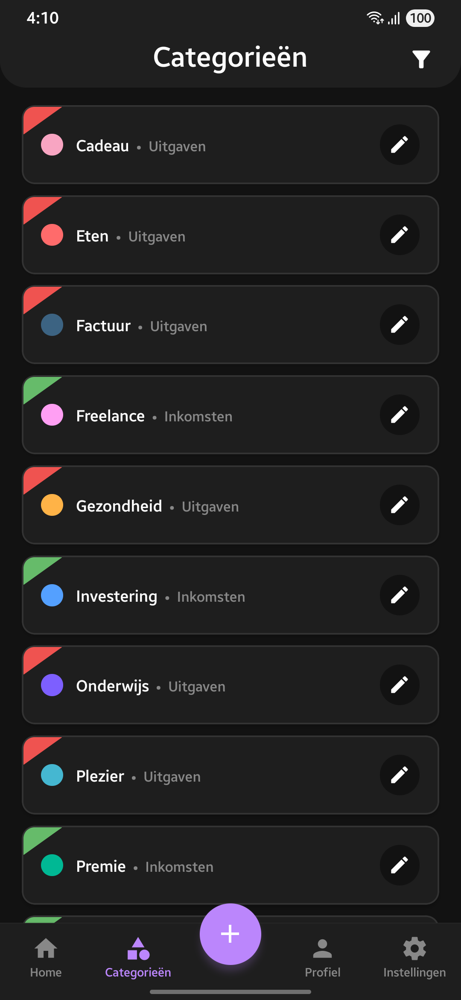
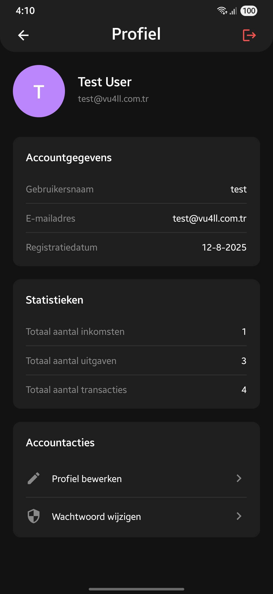

# Monedsa - Inkomsten & Uitgaven Tracker


[Turks](README_TR.md) | [Engels](README.md) | Nederlands

[](https://play.google.com/store/apps/details?id=com.vu4ll.monedsa)


**Monedsa** is een moderne en gebruiksvriendelijke mobiele applicatie waarmee u eenvoudig uw inkomsten en uitgaven kunt bijhouden op Android-apparaten. Met zijn eenvoudige, snelle en veilige structuur helpt het u uw financiële situatie onder controle te houden.

## 📱 Functies

### 💰 Inkomsten & Uitgaven Beheer
- Voeg eenvoudig uw inkomsten en uitgaven toe, bewerk en verwijder ze
- Organiseer uw transacties met gedetailleerde beschrijvingen en categorieën
- Real-time balansberekening

### 📊 Categoriesysteem
- Maak aangepaste categorieën aan
- Onderscheid uw categorieën met kleurcodering systeem
- Gescheiden categoriebeheer voor inkomsten en uitgaven

### 🌐 Meertalige & Valuta Ondersteuning
- Meertalige interface (Engels, Turks, Nederlands)
- Eenvoudig schakelen tussen ondersteunde talen
- Ondersteuning voor meerdere valuta's voor transacties
- Stel uw voorkeursvaluta in voor saldo en rapporten

### 📈 Financiële Analyse
- Totaal inkomsten, uitgaven en balans overzicht
- Transactiegeschiedenis en gedetailleerde rapportage
- Filter- en sorteerfuncties

### 🔒 Beveiliging
- Veilige gegevensopslag met gebruikersaccountsysteem
- JWT token-gebaseerde authenticatie
- Versleutelde gegevensoverdracht

### 🎨 Moderne Interface
- Donkere en lichte thema ondersteuning
- Responsief ontwerp
- Intuïtieve gebruikerservaring

## 🚀 Snelle Start

### Vereisten

- **Node.js** 18 of hoger
- **React Native CLI** geïnstalleerd
- **Android 7 (API 24)** of hoger apparaat
- **Android Studio** (voor Android ontwikkeling)
- **MongoDB** database

### Installatie

1. **Kloon het project:**
```bash
git clone https://github.com/Vu4ll/monedsa.git
cd monedsa
```

2. **Backend setup:**
```bash
cd server
npm install
```

3. **Backend configuratie:**
```bash
# Maak .env bestand aan in server directory
cp .env.example .env
# Bewerk de vereiste omgevingsvariabelen
```

4. **Frontend setup:**
```bash
# Ga terug naar hoofddirectory
cd ..
npm install
```

5. **Installeer Android afhankelijkheden:**
```bash
cd android
./gradlew clean
cd ..
```

### Uitvoeren

1. **Start de backend server:**
```bash
cd server
npm start
# of voor ontwikkelingsmodus
npm run dev
```

2. **Start React Native Metro server:**
```bash
# In hoofddirectory
npm start
```

3. **Voer Android applicatie uit:**
```bash
npm run android
```

## 🏗️ Project Structuur

```
monedsa/
├── 📱 src/                    # React Native broncode
│   ├── components/            # Herbruikbare componenten
│   ├── screens/              # Applicatie schermen
│   ├── services/             # API service laag
│   ├── hooks/                # Aangepaste React hooks
│   ├── contexts/             # React contexts
│   ├── utils/                # Hulpfuncties
│   └── constants/            # Constanten en configuraties
├── 🖥️ server/                 # Node.js backend
│   ├── routes/               # API routes
│   ├── models/               # MongoDB modellen
│   ├── middlewares/          # Express middlewares
│   ├── utils/                # Backend hulpfuncties
│   ├── locales/              # Meertalige ondersteuning
│   └── public/               # Statische bestanden
└── 📂 android/               # Android native code
```

## 🔧 Technologieën

### Frontend (Mobiel)
- **React Native** 0.80.1
- **React Navigation** - Navigatiesysteem
- **Axios** - HTTP client
- **AsyncStorage** - Lokale gegevensopslag
- **Vector Icons** - Pictogrambibliotheek

### Backend
- **Node.js** & **Express** - Webserver
- **MongoDB** & **Mongoose** - Database
- **JWT** - Authenticatie
- **Argon2** - Wachtwoord hashing
- **CORS** - Cross-origin resource sharing

## 📊 API Endpoints

### Authenticatie
```
POST /api/auth/login          # Gebruiker inloggen
POST /api/auth/register       # Gebruiker registratie
POST /api/auth/refresh        # Token vernieuwen
```

### Transacties
```
GET    /api/transaction/list     # Transactielijst
POST   /api/transaction/add      # Nieuwe transactie toevoegen
PUT    /api/transaction/edit/:id # Transactie bijwerken
DELETE /api/transaction/delete/:id # Transactie verwijderen
GET    /api/transaction/expenses # Alleen uitgaven
GET    /api/transaction/incomes  # Alleen inkomsten
```

### Categorieën
```
GET    /api/category/list        # Categorielijst
POST   /api/category/add         # Nieuwe categorie
PUT    /api/category/edit/:id    # Categorie bijwerken
DELETE /api/category/delete/:id  # Categorie verwijderen
```

### Profiel
```
GET  /api/profile/me             # Gebruikersinformatie
GET  /api/profile/stats          # Statistieken
PUT  /api/profile/update         # Profiel bijwerken
PUT  /api/profile/change-password # Wachtwoord wijzigen
```

## 🌟 Screenshots

| Startscherm | Startscherm (Wit Thema) | Transactie Toevoegen (Wit Thema) | Categorieën | Profiel |
|-----------|-----------|-----------|-----------|-----------|
|  |  |  |  |  |

- Startscherm: Balans overzicht en recente transacties
- Transactie Toevoegen: Nieuw inkomsten/uitgaven invoerformulier
- Categorieën: Categoriebeheer en kleurselectie
- Profiel: Gebruikersinformatie en statistieken

## 🤝 Bijdragen

1. Fork dit project
2. Maak een nieuwe feature branch aan (`git checkout -b feature/nieuwe-functie`)
3. Commit uw wijzigingen (`git commit -am 'Voeg nieuwe functie toe'`)
4. Push uw branch (`git push origin feature/nieuwe-functie`)
5. Maak een Pull Request aan

## 📝 Licentie

- Dit project is gelicentieerd onder de GPL3 Licentie. Zie het [LICENSE](LICENSE) bestand voor details.
- **Privacybeleid**: [monedsa.vu4ll.com.tr/privacy-policy](https://monedsa.vu4ll.com.tr/privacy-policy/nl)

## 📞 Contact

- **Website:** [vu4ll.com.tr](https://vu4ll.com.tr)
- **E-mail:** [contact@vu4ll.com.tr](mailto:contact@vu4ll.com.tr)

---

**Monedsa** - Houd uw financiële situatie eenvoudig bij en houd uw budget onder controle! 💰📊
